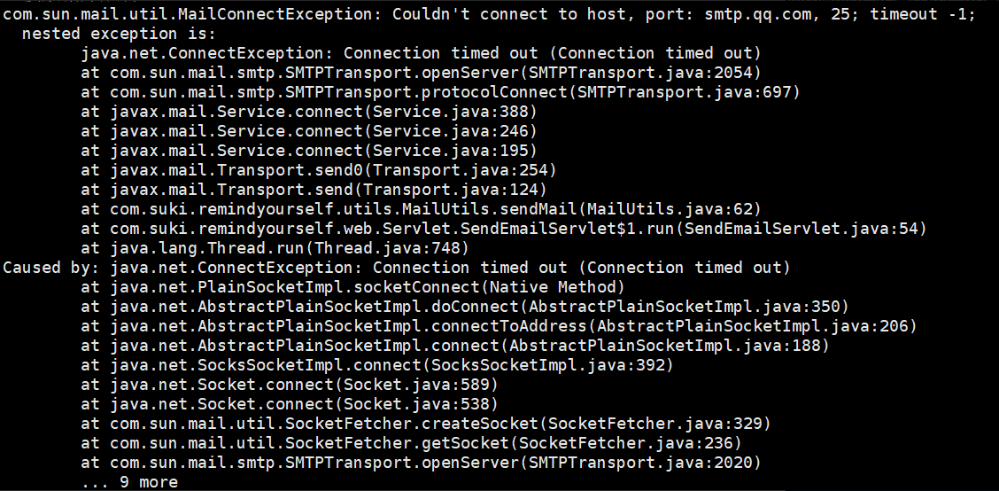
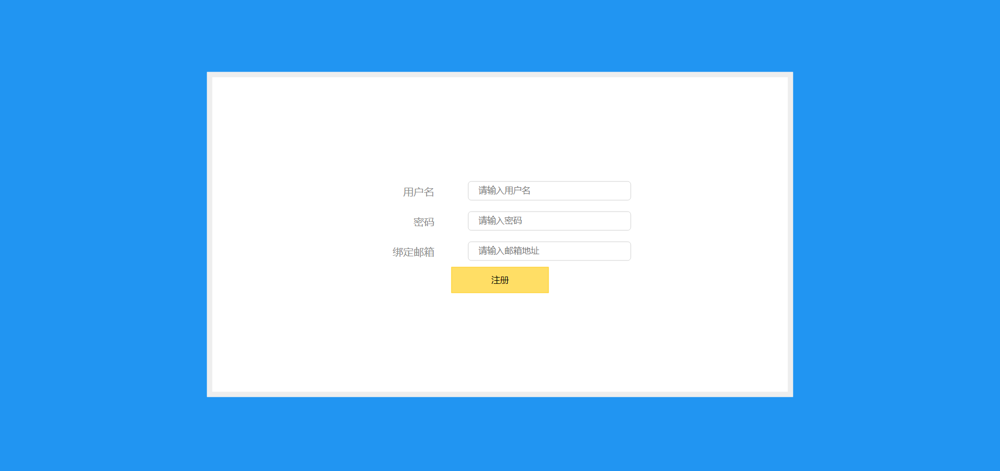

[TOC]


## Remind Yourself网站

>  学完`Java Web`之后的练手项目
>
>  目前只是第一版，以后会慢慢完善的，敬请期待！
>
>  目前UI只针对电脑端浏览器，移动端并未进行适配，请谅解！（以后会跟进
>
>  2019-8-20更新：使用maven构建整个项目
>
>  2019-8-20优化：首页打开速度提升


+ 灵感来源
    + 现在总是会忘事
    + 使用过一段时间的主流`提醒事项`App，但是体验效果一般
    + 结合`Java Web`写了一个网页端的提醒事项网站
    + 基本原理：通过`发送邮件`的方式按时提醒我具体的提醒事项

+ 想体验本网站？[点击这里](http://203.195.245.250/remindYourself)

### 设计数据库结构

> 分为两张表，一张user表和一张event表

user表的结构为：

| id   | username | password | email |
| ---- | -------- | -------- | ----- |
|      |          |          |       |

event表的结构为：

| id   | establish_time | remind_time | content | state | for_user_id |
| ---- | -------------- | ----------- | ------- | ----- | ----------- |
|      |                |             |         |       |             |

+ state为0代表进行中，为1代表已完成
+ 使用for_user_id来关联user表的id值


### 前后端最基本的交互方式

> 目前主流使用json数据格式

#### 前端

使用`jQuery`实现ajax异步请求和接收

其基本格式为：

```javascript
function XXX(){
  $.ajax({
      url:"填写你的Servlet",
      type:"post",
      data:{json格式},  // 发送给后端的json数据
      dataType:"json",
      success:function(recvJsonData){
          // 后端成功接收到请求后前端可接收的recvJsonData
          // 注意如果后端传回的json数据中有对象的话，注意eval()的使用
      },
      error:function(recvJsonData){
          // 后端未正确响应请求返回的recvJsonData
      }
  });  
};
```

+ 注：前端向后端发送json数据时还要注意，一开始你构建好json数据后，是不能直接发送的！在js中你得使用`JSON.stringify()`把它转成字符串后再放入到`$.ajax()`的`data`里，比如：


#### 后端

后端使用阿里的`fastjson`进行json构成与解析

后端使用`fastjson`构建json数据可参考：https://www.jianshu.com/p/31091b137453

后端接收前端的json数据可以使用`req.getParameter()`接收，再使用`JSONObject.parseObject`或`JSONArray.parseArray`转为`JSONObject`或`JSONArray`对象，如下图：


再通过`.get("键名")`的方法获取json对应的值；通过`.toJSONString()`可以获得json字符串


### 项目使用方式

虚拟目录名称：`/remindYourself`

端口已改为80

首先配置`JDBC.properties`文件

```properties
driverClassName=com.mysql.jdbc.Driver # mysql驱动，不改
url=jdbc:mysql://localhost:3306  # localhost:3306改为[你的ip:你的mysql开放的端口]
dataBase=remind_yourself  # 数据库的名称
userTable=user  #  user表的名称
eventTable=event  # event表的名称，用于存放用户的提醒事项的事件
username=root  # mysql登录用户名
password=  # mysql登录用户名对应的密码
```

sql文件放在`web/sql`文件夹之中，如果是部署在远程服务器上，在本地使用数据库连接软件后执行sql文件即可

上面都设置好以后，网站就可以启动运行了！


### 注意点

+ 将项目部署到云服务器之后会发现邮件发不出去，主要原因是云服务器厂商有可能禁止了`25端口`的开放



解决方法参考：https://blog.csdn.net/qq_33522040/article/details/82813244


### 网站截图

首页


注册页



登录页


用户主页

